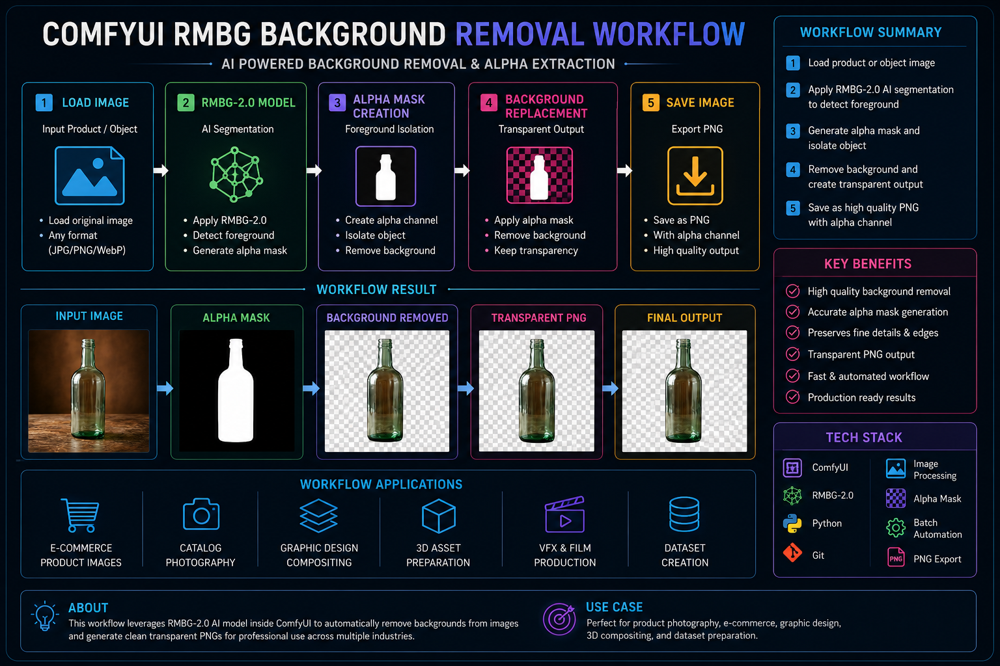
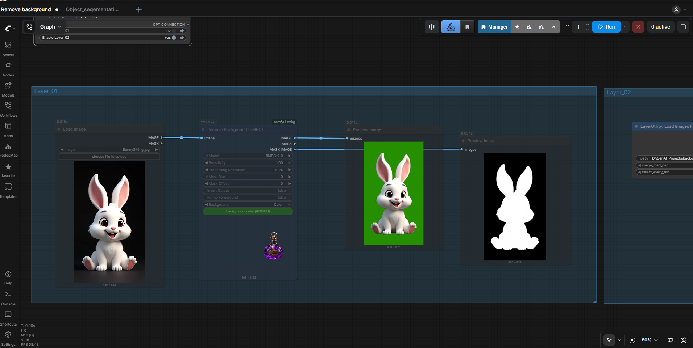
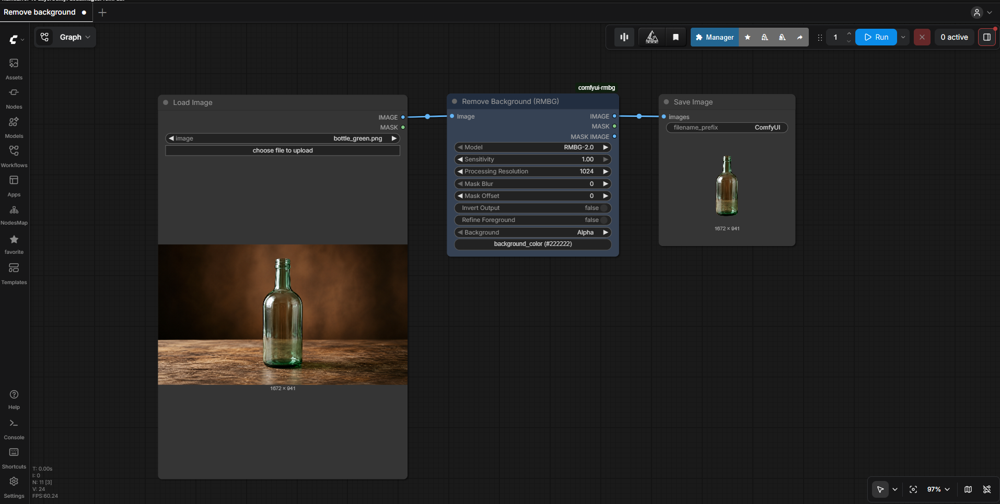
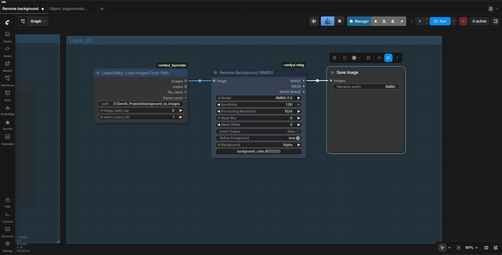
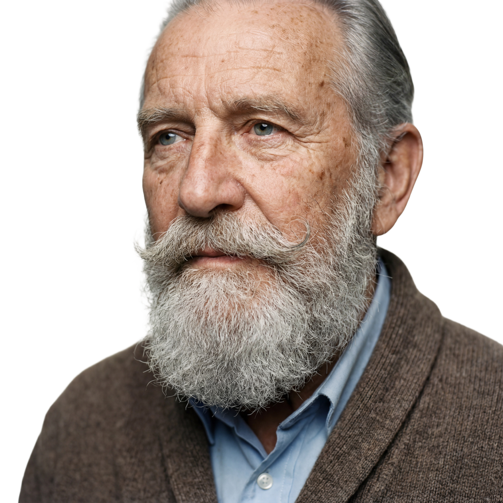

# ComfyUI RMBG-2.0 Background Removal Pipeline

A production-oriented ComfyUI workflow designed for automatic background removal using RMBG-2.0.

This workflow demonstrates AI-powered foreground extraction and alpha mask generation for creating clean transparent PNG assets suitable for e-commerce, product photography, dataset preparation, compositing, and digital content creation.

---

## Project Overview

Background removal is a common production task across:

* E-commerce
* Product Photography
* Marketing
* VFX
* Dataset Preparation
* Asset Libraries

Traditional background removal requires manual masking and rotoscoping.

This workflow automates the process using RMBG-2.0.

---

## Architecture Diagram

---

## Workflow Graph

---

## Sample Outputs

### Input Product

### Final Transparent PNG

---

## Workflow Structure

Load Image

↓

RMBG-2.0 Segmentation

↓

Alpha Mask Generation

↓

Background Removal

↓

PNG Export

---

## Technical Stack

| Category           | Technology |
| ------------------ | ---------- |
| Workflow Engine    | ComfyUI    |
| Segmentation Model | RMBG-2.0   |
| Image Processing   | OpenCV     |
| Programming        | Python     |
| Export Format      | PNG Alpha  |
| Version Control    | Git        |

---

## Documentation

| Document                                            | Description                                 |
| --------------------------------------------------- | ------------------------------------------- |
| 📘 [Node Explanations](docs/node-explanations.md)   | Detailed explanation of workflow nodes      |
| 📗 [Optimization Notes](docs/optimization-notes.md) | Workflow testing and optimization decisions |

---

## Applications

* Product Photography
* E-Commerce
* Marketing Assets
* Dataset Creation
* Asset Libraries
* VFX Compositing
* Digital Advertising

---

## Learning Objectives

* Background Removal
* Alpha Mask Generation
* Semantic Segmentation
* Asset Preparation
* Production Automation

---

## Future Improvements

* Batch Processing
* SAM3 Integration
* Automatic Asset Cropping
* Multi-Object Segmentation
* Dataset Automation

---

## Author

Gowtham Subramanian

Generative AI Workflow Designer | Technical Artist | Senior Digital Compositor
